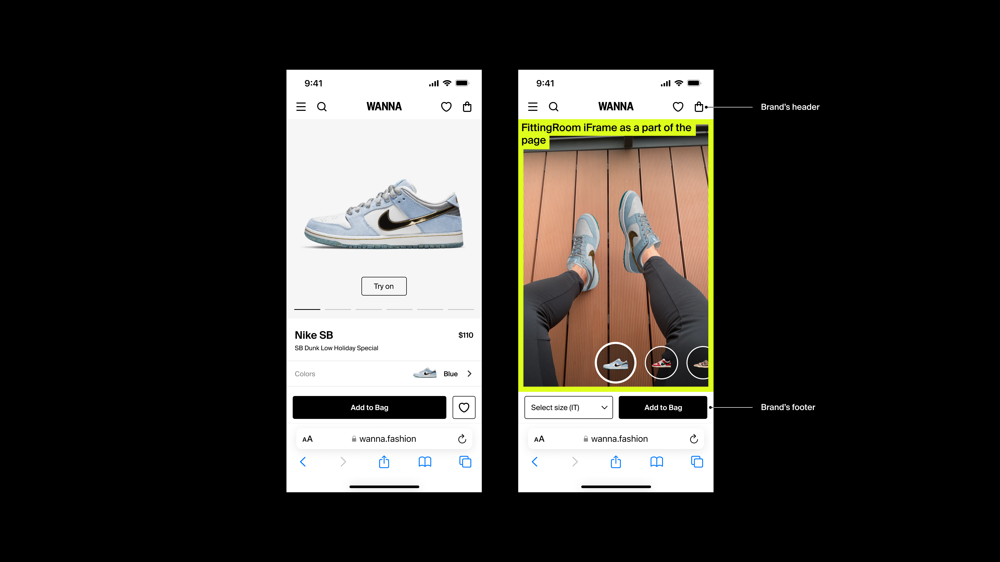
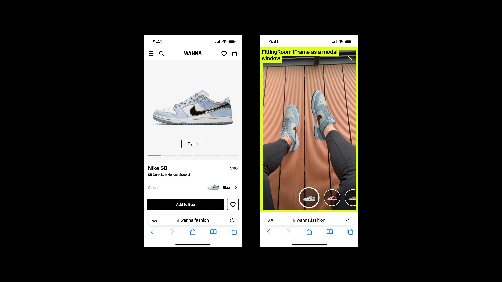
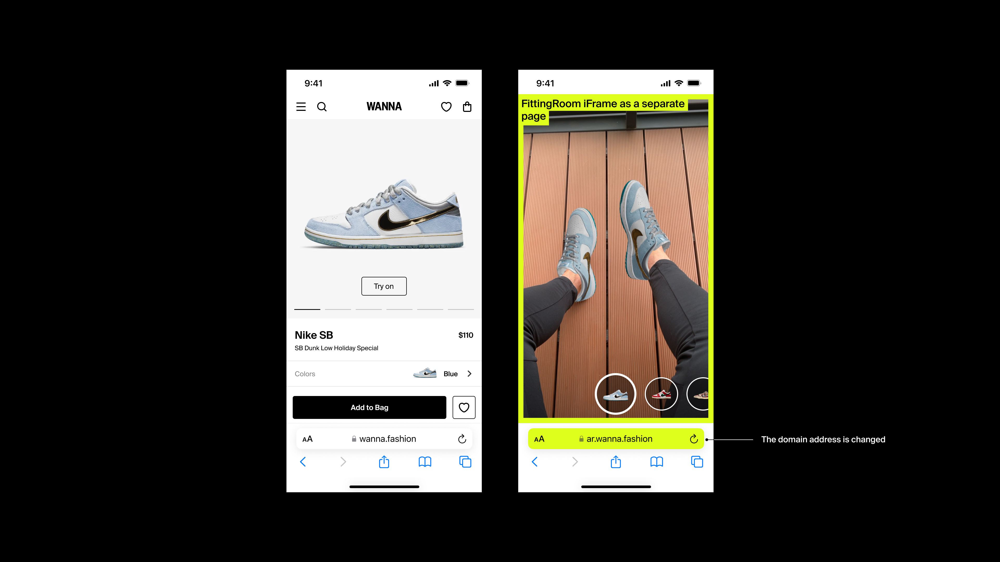

# WANNA Virtual Fitting Room

WANNA Virtual Fitting Room (VFR) is a low-code solution with a customizable prebuilt UI. To integrate it into your website, you only need to add an iframe to the page. The user will be able to try on the products in real time using their smartphone camera and to explore the 3D image of the product on a separate screen.

<!-- TOC -->
- [Prerequisites](#prerequisites)
- [Mobile: show the fitting room](#mobile-show-the-fitting-room)
	- [Iframe settings](#iframe-settings)
	- [Get the current model ID](#get-the-current-model-id)
- [Desktop: display a QR code](#desktop-display-a-qr-code)
<!-- /TOC -->

## Prerequisites

In this tutorial, you will be integrating a fitting room that was already configured for you by WANNA engineers. You should have:

* a link to your personal fitting room
* the list of model IDs that will be tried on (you will use it to select which models to display and which one to start with)

Virtual Fitting Room could only be comfortably used for virtual try-on [on a smartphone](#mobile-show-the-fitting-room). You probably already have different versions of your website for desktop and mobile devices, but if not, you will need to implement the selection on your side. For [desktop version](#desktop-display-a-qr-code) we recommend displaying a QR code with the link to smoothly guide the user to the virtual try-on page.

The 3D Viewer component may be displayed on both desktop and mobile devices.

## Mobile: show the fitting room

The essential part of integration is simply to load the Virtual Fitting Room or 3D Viewer component into an iframe on the page or just open it in a separate page. Choose the look and user experience you would prefer. There are three main options:

* **[recommended]** build the component into your page, leaving the original header and footer in place: </br> 
* show the component in a pop-up modal that overlays the page from which it was started: </br> 
* redirect to another page with the fullscreen view of the fitting room: </br> 

We recommend the first option, as it ensures the best user experience and more likely conversion of try-on into purchase. Let's walk through the process.

**Important!** The iframe should have camera access. Specify it in the `allow` attribute, and the browser will ask the user for permission to access the camera.

First, create an iframe element on the page and put the link to your Virtual Fitting Room into its `src` attribute:

```javascript
 const iframe = document.createElement('iframe')
// camera access is required
iframe.allow = 'camera'
iframe.src = vfrLink
```

### Iframe settings

Add query parameters to the link to configure the component behavior. Virtual Fitting Room and 3D Viewer parameters differ slightly.

| Parameter               | Fitting Room      | 3D Viewer                 | Description                                                                                      |
|-------------------------| :---------------: | :-----------------------: |--------------------------------------------------------------------------------------------------|
| `modelid`, **required** | **+**<br />a list | **+**<br />a single value | The model identifiers for the models that should be displayed in the component.                                   |
| `startwithid`           | **+**             | **-**                     | The identifier of the model that should be loaded first. Note that the order of the models won't change. |
| `showonboarding`        | **-**             | **+**                     | Indicates if the 3D Viewer should display a small tutorial at the start. If you use cookies to remember if the user has already interacted with 3D Viewer, this parameter will help you show the tutorial only for the first visit of the user. The only possible value is `3d`. |
| `viewmode`              | **-**             | **+**                     | Specifies if the 3D Viewer is loaded on a desktop or a mobile device. It has small UI differences to improve the user experience. The possible values are: `desktop` or `mobile`. |
| `locale`                | **+**             | **+**                     | The locale code for the UI language and metadata. If the specified locale isn't available, English will be used instead. |      

For example, the following link will show only two models to be tried on in the Virtual Fitting Room, start with the second one, and display the interface and page metadata in German: 

```
https://demo.ar.wanna.fashion/?modelid=wanna01,wanna02&startwithid=wanna02&locale=de
```

The following link will show the tutorial when 3D Viewer is loaded and display the interface and page metadata in Italian:

`https://bags-demo.ar.wanna.fashion/?modelid=wanna_bag&showonboarding=3d&locale=it`

### Get the current model ID

**Note:** This section only makes sense for Virtual Fitting Room, as in 3D Viewer you're always loading a single model and know its identifier.

It should be easy for the user to buy or add to favorites the model they're trying on. You may want to add, for example, an "Add to cart" button to the page footer. To do that, you will need to get in real time the identifier of the model that is being tried on now. Listen to events from the fitting room. Virtual Fitting Room raises the `MODEL_SET` event that contains the ID of the model that is currently loaded. The `data` property of event has following properties:

- `event` (type `string`) — the name of the event
- `data` (type `object`) — the event data

Virtual Fitting Room only raises one kind of an event:

| Event name    | Description                                    | Data properties                                  |
|---------------|------------------------------------------------|--------------------------------------------------|
| `MODEL_SET`   | The model that is currently loaded for try-on. | `modelId` (type `string`) — the model identifier |

Here's a code snippet that shows how to subscribe to events:

```javascript
window.addEventListener('message', event => {
  if (event.origin === vfrOrigin /* the origin of WANNA VFR, for example https://demo.ar.wanna.fashion */) {
    const eventName = event.data.event
    const data = event.data.data
	const model = data.modelId
    // use the model identifier, for example to find the link to the product page
  }
})
```

**Important!** Events are only available for iframe. If you're simply redirecting to Virtual Fitting Room, you won't be able to listen to events and obtain the model ID using this method.

Consult also [our demo sample](samples/iframe_mobile.html) which shows the simplest way of loading the fitting room as a pop-up modal that opens on button click.

## Desktop: display a QR code

On the product page from which you would like the client to start virtual try-on, display a QR code that the client can scan with their phone and go directly to Virtual Fitting Room on mobile. [Our sample](samples/desktop.html) uses the open-source [QR-Code-generator](https://github.com/nayuki/QR-Code-generator) library for demo purposes. Choose any QR code generating tool that suits you.

For the 3D Viewer component, integrate the iframe in the same way as you would on mobile. The only difference is be that you set the `viewmode` query parameter to `desktop` instead of `mobile`.